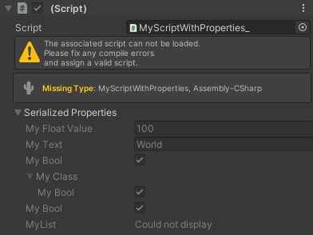

# Display missing component type info

This package must be installed to your project BEFORE you have missing scripts. Otherwise no type information is serialized and can therefore not be displayed later when you have missing scripts in a prefab or scene.



## Installation 💾

### Use Needle Installer 🚀
1. [Click here](https://package-installer.glitch.me/v1/installer/OpenUPM/com.needle.missing-component-info?registry=https://package.openupm.com) to download a Needle installer .unitypackage.   
2. Drop it into your project to install this package from [OpenUPM](https://openupm.com)  
3. That's it 

<details>
<summary>Add from OpenUPM <em>| via scoped registry, recommended</em></summary>

To add OpenUPM to your project:

- open `Edit/Project Settings/Package Manager`
- add a new Scoped Registry:
```
Name: OpenUPM
URL:  https://package.openupm.com/
Scope(s): com.needle
```
- click <kbd>Save</kbd>
- open Package Manager
- Select ``My Registries`` in dropdown top left
- Select ``Missing Component Info`` and click ``Install``
</details>


## Contact ✒️
<b>[🌵 needle — tools for unity](https://needle.tools)</b> •
[@NeedleTools](https://twitter.com/NeedleTools) •
[@marcel_wiessler](https://twitter.com/marcel_wiessler) •
[@hybridherbst](https://twitter.com/hybridherbst) •
[Needle Discord](https://discord.gg/CFZDp4b)
